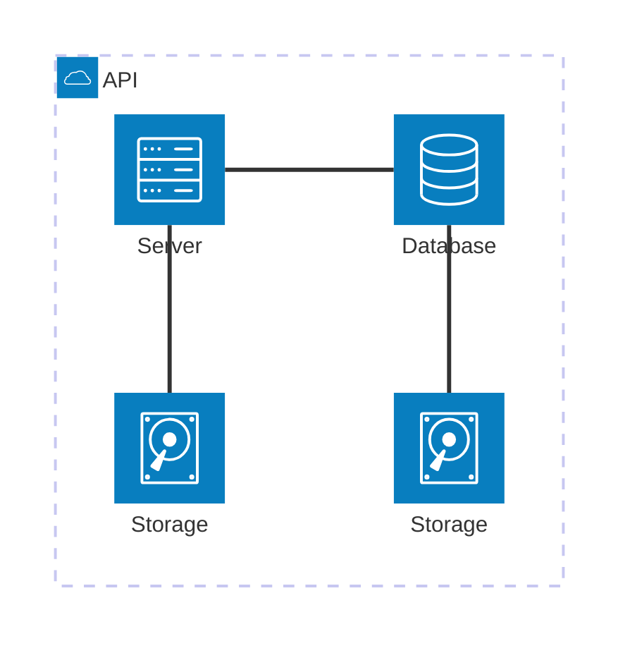

## Objetivo


Aplicar o algoritmo de árvore de decisão em um conjunto de dados de classificação, explorando e pré-processando os dados, realizando a divisão em treino e teste, treinando o modelo e avaliando seu desempenho por meio de métricas adequadas.


## Etapas

<table>
  <tr>
    <th>Etapa</th>
    <th>Critério</th>
    <th>Descrição</th>
    <th>Pontos</th>
  </tr>
  <tr>
    <td>1</td>
    <td>Exploração dos Dados (EDA)</td>
    <td>Análise inicial do conjunto de dados - com explicação sobre a natureza dos dados -, incluindo visualizações e estatísticas descritivas.</td>
    <td>20</td>
  </tr>
  <tr>
    <td>2</td>
    <td>Pré-processamento</td>
    <td>Limpeza dos dados, tratamento de valores ausentes e normalização.</td>
    <td>10</td>
  </tr>
  <tr>
    <td>3</td>
    <td>Divisão dos Dados</td>
    <td>Separação do conjunto de dados em treino e teste.</td>
    <td>20</td>
  </tr>
  <tr>
    <td>4</td>
    <td>Treinamento do Modelo</td>
    <td>Implementação do modelo Decision Tree.</td>
    <td>10</td>
  </tr>
  <tr>
    <td>5</td>
    <td>Avaliação do Modelo</td>
    <td>Avaliação do desempenho do modelo utilizando métricas apropriadas.</td>
    <td>20</td>
  </tr>
  <tr>
    <td>6</td>
    <td>Relatório Final</td>
    <td>Documentação do processo, resultados obtidos e possíveis melhorias. Obrigatório: uso do template-projeto-integrador, individual.</td>
    <td>20</td>
  </tr>
</table>


### Etapa 1

Instalando o MAAS:

<!-- termynal -->

``` bash
sudo snap install maas --channel=3.5/Stable
```


/// caption
Dashboard do MAAS
///

Conforme ilustrado acima, a tela inicial do MAAS apresenta um dashboard com informações sobre o estado atual dos servidores gerenciados. O dashboard é composto por diversos painéis, cada um exibindo informações sobre um aspecto específico do ambiente gerenciado. Os painéis podem ser configurados e personalizados de acordo com as necessidades do usuário.

### Tarefa 2

## App


### Tarefa 1

### Tarefa 2

Exemplo de diagrama



[Mermaid](https://mermaid.js.org/syntax/architecture.html){:target="_blank"}

## Questionário, Projeto ou Plano

Esse seção deve ser preenchida apenas se houver demanda do roteiro.

## Discussões

Quais as dificuldades encontradas? O que foi mais fácil? O que foi mais difícil?

## Conclusão

O que foi possível concluir com a realização do roteiro?
