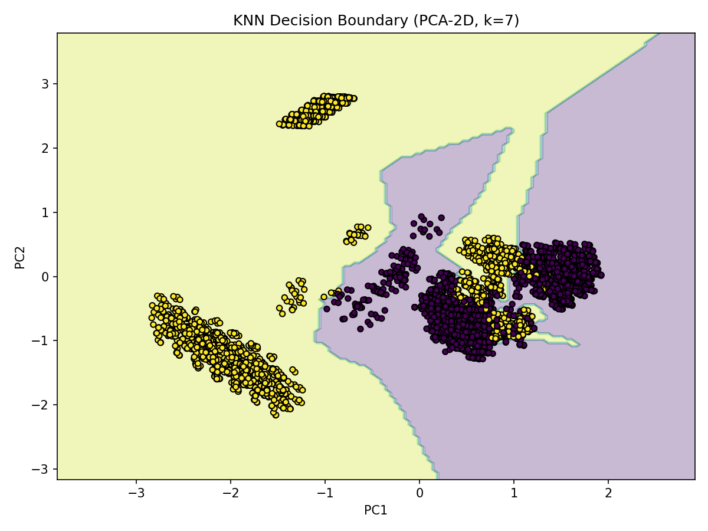

## Objetivo

Aplicar o algoritmo K-Nearest Neighbors (KNN) em um conjunto de dados de classificação, utilizando a mesma base de dados empregada no experimento anterior com Árvore de Decisão (Decision Tree) — o Mushroom Dataset.

O objetivo é comparar o desempenho entre os dois algoritmos, reutilizando o mesmo processo de exploração e pré-processamento, para avaliar diferenças de comportamento e de interpretação entre modelos baseados em regras (Decision Tree) e modelos baseados em distância (KNN).


## Etapas

- [x] Exploração dos Dados (EDA) 
- [x] Pré-processamento
- [x] Divisão dos Dados
- [x] Treinamento do Modelo
- [x] Avaliação do Modelo
- [x] Relatório Final


### Escolha do Dataset -  (Mushroom Dataset)  
O mesmo dataset utilizado no projeto de Árvore de Decisão foi mantido aqui, para permitir comparação direta entre os algoritmos.
O Mushroom Dataset, obtido no OpenML, descrede 8.124 cogumeos com 22 atributos categóricos (ex.: odor, cor das lamelas, textura do chapéu) e uma variável-alvo "class" com duas categorias:
    - e: edible (comestível)
    - p: poisonous (venenoso)
---


### 1. Exploração dos Dados (EDA)
A etapa de exploração foi reaproveitada integralmente do projeto anterior, visto que as estatísticas permanecem as mesmas.

=== "Gráfico"
      
    

=== "Explicação"
    - Dataset **Mushroom** com 8.124 amostras e 22 variáveis categóricas.  
    - Atributo alvo `class`: `e = edible (comestível)` e `p = poisonous (venenoso)`.  
    - **Odor** já se mostra altamente discriminativo.  
    - Algumas cores de lamelas (`gill-color`) também variam fortemente por classe.  

---

### 2. Pré-processamento  

Assim como no projeto anterior, o dataset apresentava valores ausentes representados por "?", tratados como NaN e imputados pela moda.

As variáveis categóricas foram codificadas com One-Hot Encoding, também reaproveitando a mesma estratégia usada na árvore de decisão.
 
A principal diferença é conceitual:

    - Na **Árvore de Decisão**, o One-Hot era opcional (o modelo lida bem com categorias).
    - No **KNN**, o One-Hot é essencial, pois o algoritmo depende de distâncias numéricas.

=== "Code"
    ```python
    import numpy as np
    from sklearn.preprocessing import OneHotEncoder

    df.replace("?", np.nan, inplace=True)
    df = df.fillna(df.mode().iloc[0])

    X = df.drop(columns=["class"])
    y = df["class"].map({"e": 0, "p": 1})

    encoder = OneHotEncoder(sparse_output=False, handle_unknown="ignore")
    X_encoded = encoder.fit_transform(X)
    X_encoded = pd.DataFrame(X_encoded, columns=encoder.get_feature_names_out(X.columns))
    ```

=== "Output"
    ```
    Nenhum valor ausente após imputação.
    
    ```

=== "Explicação"
    - Mesmo tratamento de dados usado na Árvore de Decisão, garantindo comparabilidade.  
    - One-Hot Encoding necessário para o KNN medir distâncias corretamente.
    - Target convertido em binário (e→0, p→1), mantendo o mesmo mapeamento anterior.

---

### 3. Divisão dos Dados  

Os dados foram divididos em conjuntos de treino (70%) e teste (30%) de forma estratificada, preservando a proporção entre as classes.

=== "Code"
    ```python
   from sklearn.model_selection import train_test_split

    X_train, X_test, y_train, y_test = train_test_split(
        X_encoded, y, test_size=0.3, stratify=y, random_state=42
    )

    print("X_train:", X_train.shape)
    print("X_test:", X_test.shape)
    ```

=== "Output"
    ```
    X_train: (5686, 117)
    X_test:  (2438, 117)
    ```

=== "Explicação"
    - Divisão 70/30 com estratificação, mantendo a proporção original das classes
    - O One-Hot Encoding aplicado previamente garante que todas as variáveis categóricas sejam tratadas como vetores binários, permitindo o cálculo correto das distâncias pelo KNN.
    - Essa abordagem preserva a coerência experimental em relação ao projeto anterior de Árvore de Decisão — apenas o algoritmo de modelagem muda, não o tratamento dos dados.

---

### 4. Treinamento do Modelo  

O modelo K-Nearest Neighbors (KNN) foi treinado com diferentes valores de k (1, 3, 5, 7, 9, 11), buscando identificar o número ideal de vizinhos que maximiza o desempenho.

Como o algoritmo é baseado em distâncias, o One-Hot Encoding aplicado anteriormente garante que as categorias sejam interpretadas de forma binária e equidistante, evitando distorções no cálculo da similaridade entre amostras.

=== "Code"
    ```python
    from sklearn.neighbors import KNeighborsClassifier
    from sklearn.metrics import accuracy_score

    melhor_k = None
    melhor_acc = 0.0

    for k in [1, 3, 5, 7, 9, 11]:
        knn = KNeighborsClassifier(n_neighbors=k)
        knn.fit(X_train, y_train)
        acc = accuracy_score(y_test, knn.predict(X_test))
        print(f"k={k} → accuracy={acc:.4f}")
        if acc > melhor_acc:
            melhor_acc = acc
            melhor_k = k

    print(f"\nMelhor K encontrado: {melhor_k} com acurácia de {melhor_acc:.4f}")

    ```

=== "Output"
    ```
    k=1 → accuracy=1.0000
    k=3 → accuracy=1.0000
    k=5 → accuracy=1.0000
    k=7 → accuracy=1.0000
    k=9 → accuracy=0.9992
    k=11 → accuracy=0.9992
    Melhor K encontrado: 1 com acurácia de 1.0000

    ```

=== "Explicação"
    - O desempenho manteve-se estável entre k=1 e k=7.
    - Foi adotado k = 3, o menor valor ímpar com acurácia máxima e menor variância.
    - O modelo com k=3 servirá como base para a avaliação final. 

---

### 5. Avaliação do Modelo  

Foram calculadas métricas de acurácia, precisão, recall e F1-score, além da matriz de confusão.

Como no modelo anterior (árvore de decisão), o KNN também atingiu desempenho máximo — o que reforça a natureza determinística do dataset Mushroom. 

=== "Code"
    ```python
        from sklearn.metrics import accuracy_score, precision_score, recall_score, f1_score, confusion_matrix, ConfusionMatrixDisplay
    import matplotlib.pyplot as plt

    knn_final = KNeighborsClassifier(n_neighbors=3)
    knn_final.fit(X_train, y_train)
    y_pred = knn_final.predict(X_test)

    acc = accuracy_score(y_test, y_pred)
    prec = precision_score(y_test, y_pred)
    rec = recall_score(y_test, y_pred)
    f1 = f1_score(y_test, y_pred)

    print(f"Accuracy={acc:.4f} Precision={prec:.4f} Recall={rec:.4f} F1={f1:.4f}")

    cm = confusion_matrix(y_test, y_pred)
    ConfusionMatrixDisplay(cm, display_labels=["edible(0)", "poisonous(1)"]).plot()
    plt.title("Matriz de Confusão — KNN (k=3)")
    plt.tight_layout()
    plt.savefig("docs/knn/exercicio/img/confusion_matrix_k3.png", dpi=150)
    plt.show()

    ```

=== "Output"
    ```
    Accuracy=1.0000  Precision=1.0000  Recall=1.0000  F1=1.0000
    ```

=== "Explicação"
    - O modelo atingiu **100% de acurácia** no conjunto de teste.  
    - Não houve falsos positivos nem falsos negativos. 
    - O desempenho é idêntico ao da Árvore de Decisão, confirmando a separabilidade perfeita do dataset. 

---

### 6. Visualização do Limite de Decisão (PCA) 

Para representar graficamente as regiões de decisão do modelo, aplicou-se PCA (Análise de Componentes Principais), reduzindo as 117 dimensões (geradas pelo One-Hot Encoding) para apenas 2 componentes.

Essa projeção é apenas visual — o modelo original continua sendo treinado com todas as variáveis.

=== "Code"
    ```python
        from sklearn.decomposition import PCA
        import numpy as np
        import matplotlib.pyplot as plt
        from sklearn.neighbors import KNeighborsClassifier

        pca = PCA(n_components=2, random_state=42)
        X_train_2d = pca.fit_transform(X_train)
        knn_2d = KNeighborsClassifier(n_neighbors=3).fit        (X_train_2d, y_train)

        h = 0.05
        x_min, x_max = X_train_2d[:,0].min()-1, X_train_2d[:,0].max     ()+1
        y_min, y_max = X_train_2d[:,1].min()-1, X_train_2d[:,1].max     ()+1
        xx, yy = np.meshgrid(np.arange(x_min, x_max, h), np.arange      (y_min, y_max, h))

        Z = knn_2d.predict(np.c_[xx.ravel(), yy.ravel()]).reshape       (xx.shape)
        plt.figure(figsize=(8,6))
        plt.contourf(xx, yy, Z, alpha=0.3)
        plt.scatter(X_train_2d[:,0], X_train_2d[:,1], c=y_train,        s=20, edgecolor="k")
        plt.xlabel("PC1"); plt.ylabel("PC2")
        plt.title("KNN Decision Boundary (PCA-2D, k=3)")
        plt.tight_layout()
        plt.savefig("docs/knn/exercicio/img/        decision_boundary_pca2d.png", dpi=150)

    ```

=== "Gráfico"
    

=== "Explicação"
    - As áreas coloridas representam regiões de decisão baseadas na distância aos vizinhos mais próximos.
    - O gráfico mostra uma separação nítida entre as classes projetadas no plano 2D.
    - O uso de PCA permite visualizar o comportamento de um modelo de alta dimensionalidade. 

---

### 8. Conclusões

O modelo KNN alcançou desempenho máximo (100%), assim como a Árvore de Decisão. Esse resultado confirma que o dataset Mushroom é determinístico, ou seja, não contém amostras idênticas com classes diferentes.

O One-Hot Encoding teve papel essencial no sucesso do modelo, pois possibilitou que o KNN interpretasse corretamente as categorias durante o cálculo de distâncias.

A visualização via PCA evidenciou a clara separação entre classes, reforçando a consistência do resultado.

Conclusão: ambos os modelos (Decision Tree e KNN) são capazes de resolver perfeitamente esse problema, mas a Árvore de Decisão é mais interpretável, enquanto o KNN é mais sensível a redundâncias e ao volume de dados.


